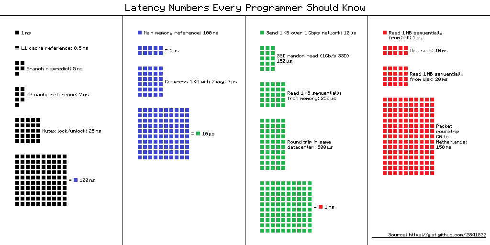

# 2의 제곱수

1 byte = 8 bit
1 kb = 1024 byte = 2^10
1 mb = 1024 kbyte = 2^20
1 gb = 1024 mbyte = 2^30

ASCII 문자 1개 = 1 byte

|2의 제곱|근사치|이름|축약|
|---|---|---|---|
|10|1 thousand(1천만)|1 kilobyte|1KB|
|20|1 million(1백만)|1 megabyte|1MB|
|30|1 billion(10억)|1 gigabyte|1GB|
|40|1 trillion(1조)|1 terabyte|1TB|
|50|1 quadrillion(1000조)|1 petabyte|1PB|

출처 : https://gist.github.com/hellerbarde/2843375

## 많이 출제되는 개략적 규모 추정 문제

* QPS
* 최대 QPS
* 저장소 요구량
* 캐시 요구량
* 서버 수

