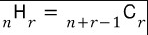

[BOJ 1010번 다리 놓기](https://www.acmicpc.net/problem/1010)

처음에 아주 어렵게 생각했다ㅋㅋㅋ;;   
N개의 사이트는 무조건 순서가 정해져 있고, N <= M 이니까 다리를 연결하고 남은 (M-N) 개의 사이트의 순서를 배치하면 된다고 생각했다. 그렇게 되면 중복 조합으로 (M-N+1)H(N)이 된다. 그리고 이걸 조합으로 다시 계산하면   

   

로 (M)C(N)이 된다.   

그렇다...! 결국 그냥 M개의 사이트 중에서 순서 관계없이 N개를 뽑으면 되는 것이었다ㅋㅋㅋㅋ(굉장히 어렵게 푸는 편)   
어차피 다리가 겹치면 안되니 사이트의 순서는 정해져 있다. 그러므로 순서없이 뽑으면 된다.   

결국 이 문제는 그냥 조합을 구현하는 문제였다.

> 풀이

```c++ {numberLines}
#include <iostream>
using namespace std;

int matrix[31][31];

int Combination(int n, int r) {
  if(matrix[n][r]!=0) return matrix[n][r];

  matrix[n-1][r] = Combination(n-1, r);
  matrix[n-1][r-1] = Combination(n-1, r-1);

  return matrix[n-1][r]+matrix[n-1][r-1];
}

int main() {
  int T, N, M;
  cin>>T;

  for(int i=0;i<31;i++){
    matrix[i][0] = 1;
    matrix[i][i] = 1;
    matrix[i][i-1] = i;
    matrix[i][1] = i;
  }

  for(int i=0;i<T;i++){
    cin >> N >> M;
    cout<< Combination(M, N)<<'\n';
  }

  return 0;
}
```

난 `matrix` 2차원 배열을 추가해서 이미 계산한 값들은 저장해놓을 수 있게 했다.

> 시간복잡도

최악의 경우에 한 `Combination` 함수에서 두 개의 같은 함수를 호출하므로 O(2^n)이 된다.


> 다른 풀이

다른 사람의 풀이를 보니 재귀로 풀지 않고, 그냥 조합 공식을 구현했다.

```c++ {numberLines}
#include<cstdio>
#include<cstdlib>
#include<algorithm>
using namespace std;

int main(void)
{
	int n, a, b;
	long long ans;
	scanf("%d", &n);
	for (int i = 0; i < n; i++)
	{
		scanf("%d %d", &a, &b);
		ans = 1;
		if (a < b)
			swap(a, b);
		for (int i = 1; i <= b; i++)
		{
			ans *= (long long)(a + 1 - i);
			ans /= (long long)i;
		}
		printf("%lld\n", ans);
	}
	return 0;
}
```
