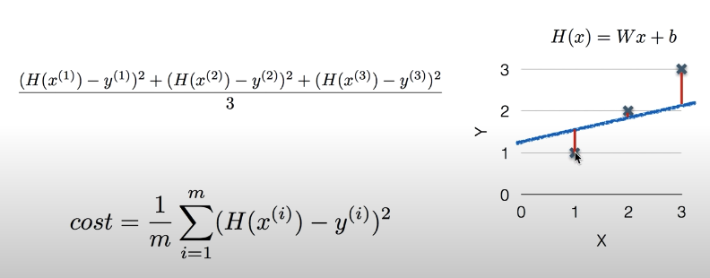
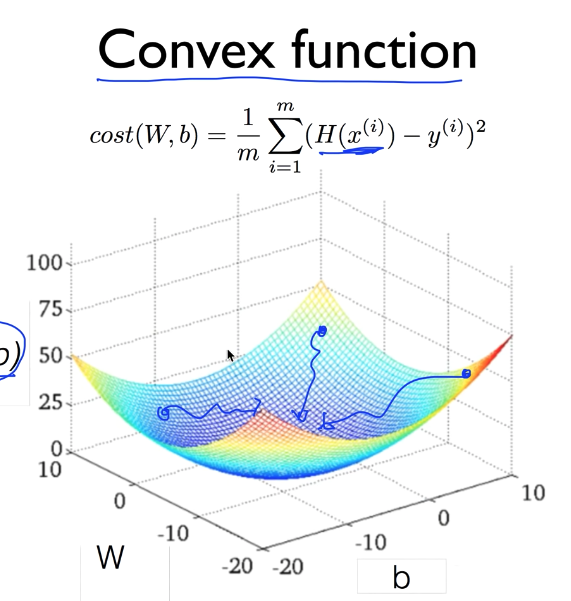

## 선형 회귀(Linear Regression)

> H(x) = Wx + b

로 표현할 수 있다.
어떠한 변수 x에 대해서 결과값인 `H(x)`이 선형으로 나타난다.

## Cost Function / Loss Function

> line이 얼마나 데이터에 잘 맞는지 

코스트가 작을 수록 좋은 예측일 수 있다.

## Gradient descent algorithm

* cost에 대한 그래프를 그러서 기울기가 낮은 쪽으로 계속해서 W를 설정하는 것   
* 기울기가 양수이면 W는 마이너스 방향으로 움직여야 함, vice versa
    * 그래서 `W - 기울기` 한다
    * 

* Convex function

Cost(W, b)의 그래프가 이 모양이면 Gradient 적용 가능하다

