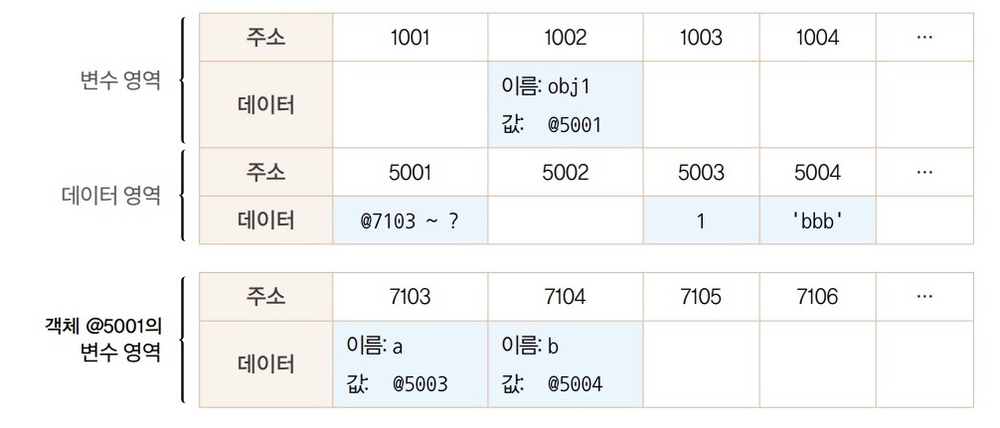
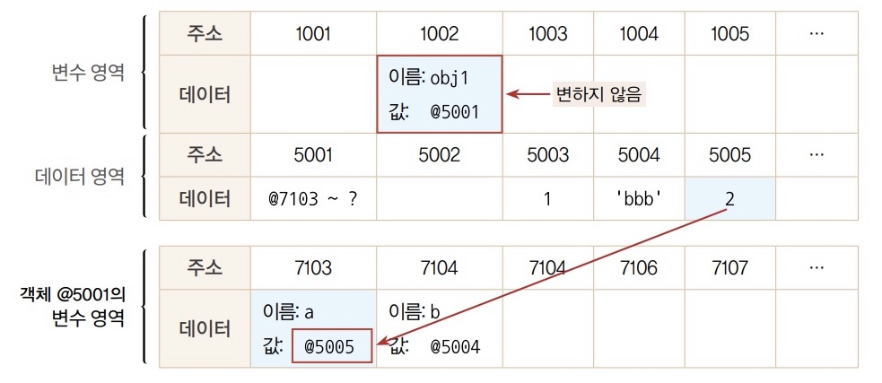
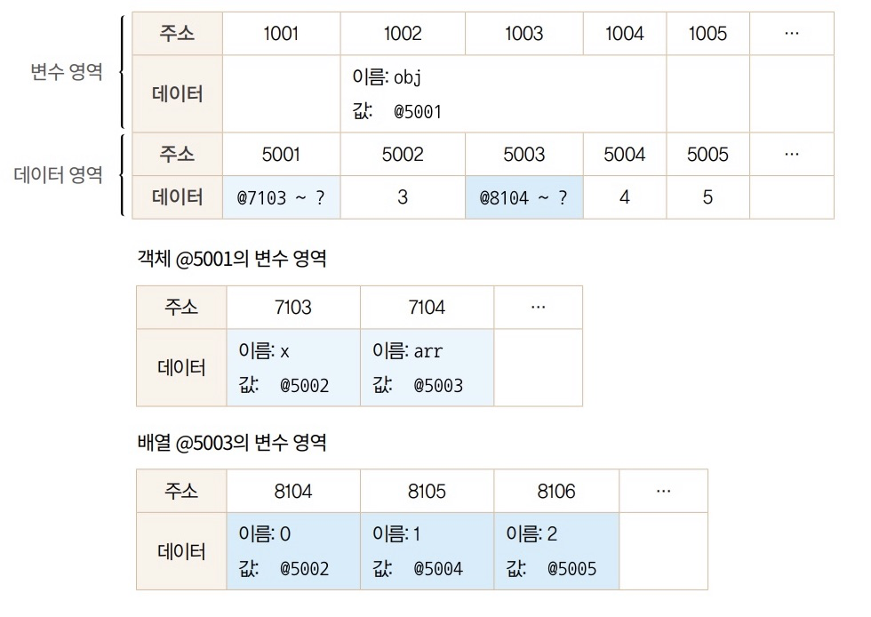
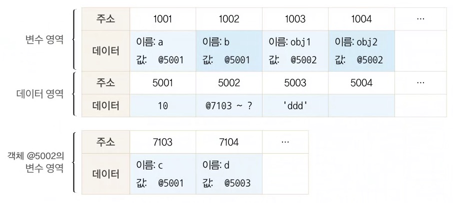
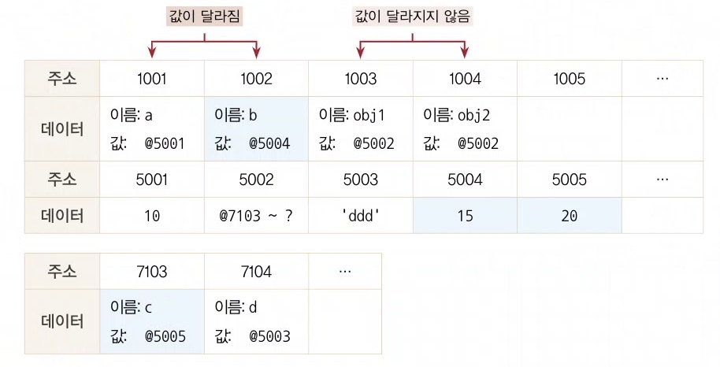
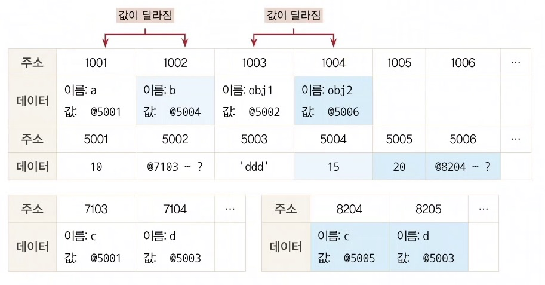

# 01 데이터 타입

## 데이터 타입의 종류

자바스크립트의 데이터 타입은 크게 2가지

1. 기본형(primitive type)
   * number
   * string
   * boolean
   * null
   * undefined
   * Symbol(ES6)
2. 참조형(reference type)
   * Object
     * Array
     * Function
     * Date
     * RegExp
     * (ES6) Map, WeakMap, Set, WeakSet

기본형은 할당/연산 시 복제되고 참조형은 참조된다.

기본형은 값이 담긴 주솟값을 바로 복제, 참조형은 값이 담긴 주솟값들로 이루어진 묶음을 가리키는 주솟값을 복제

기본형은 불변성을(immutability)를 띈다.


## 데이터 타입에 관한 배경지식

### 메모리와 데이터

C++, Java와 같은 정적 타입 언어는 데이터 타입별로 할당할 메모리 영역을 나누어 정해놓았다. 그래서 정수형 타입(short)의 경우 -32768~ +32768의 숫자만 허용하고 그 이상의 숫자를 입력하면 오류가 나거나 잘못된 값이 저장된다.

자바스크립트는 숫자의 경우 정수형/부동소수형인지 구분하지 않고 8바이트를 확보한다.

모든 데이터는 **메모리 주솟값(바이트 단위의 식별자)**을 통해 서로 구분하고 연결할 수 있다.

### 식별자와 변수

변수 : 변수할 수 있는 데이터(숫자, 문자열, 객체, 배열 등)

식별자 : 변수명


## 변수 선언과 데이터 할당

### 변수 선언

변수는 **변경 가능한 데이터가 담길 수 있는 공간 또는 그릇**

메모리 영역은 <u>**주소**</u>와 <u>**데이터**</u>로 이루어져 있다.

변수를 선언하면 메모리 영역에 변수의 <u>식별자</u>(공간의 이름)와 <u>값</u>이 데이터 영역에 저장된다.

### 데이터 할당

```js
var a;
a = 'abc';

var a = 'abc';
```

1,2 번째 줄과 4번째 줄은 같은 동작을 한다. 변수 `a`를 선언할 경우 메모리 영역에 `a`라는 이름을 가진 공간을 확보하고 그 곳에 값을 저장한다.

하지만 메모리 `a` 영역에 실제로 값을 저장하는 게 아니라, 값을 다른 곳에 저장한 후 그 다른 곳의 주소를 가져와 `a`의 공간에 저장한다.

메모리 영역은 '변수 영역'과 '데이터 영역'이 따로 존재한다. 변수 영역에는 변수의 식별자와 값을 저장할 데이터 영역의 주소가 저장된다. 데이터 영역에는 변수의 데이터가 저장된다. 

변수 영역에 값을 대입하지 않고 굳이 번거롭게 한 단계를 더 거치는 이유는 데이터 변환을 자유롭게 할 수 있게 함과 메모리를 더욱 효율적으로 관리하기 위함이다. 그래서 `a` 변수의 데이터가 'abcdef'로 변경될 경우 'abc'가 저장된 데이터 영역에 'abcdef'를 할당하는 대신, 'abcdef' 문자열을 새로 만들어 새로운 데이터 영역에 저장 후, `a`의 변수 영역에 새로 만들어진 'abcdef' 데이터 영역의 주소를 저장한다. 그리고 이전에 저장되어 있던 'abc'의 데이터 영역은 참조하는 변수가 하나도 없게 되면 가비지 컬렉터(GC)의 수거 대상이 된다.

데이터 영역과 변수 영역을 분리하는 것의 또 다른 이점은 중복된 데이터에 대한 처리 효율이 높아진다는 것이다. 예를 들어 500개의 변수에 숫자 5를 할당하게 될 경우 데이터 영역에 5를 저장한 후 이 주소만 500개의 변수들이 각자의 변수 영역에 저장하면 된다.

## 기본형 데이터와 참조형 데이터

### 불변값

변수와 상수를 구분하는 성질은 '변경 가능성'이다. 그리고 이 대상은 **변수 영역** 메모리이다. 한 번 데이터 할당이 이뤄진 변수 공간에 다른 데이터를 재할당할 수 있는지?가 관건.

불변성 여부를 구분할 때 변경 가능성의 대상은 **데이터 영역** 메모리이다.

기본형 데이터는 모두 불변값이다. 

```js
var a = 'abc';
a = a + 'def';

var b = 5;
var c = 5;
b = 6;
```

1. 2번째 줄에서 a의 값을 'abcdef'로 변경
   'abcdef'라는 값을 데이터 영역에 새로 할당 후 `a`의 변수 영역에 데이터 주소를 변경한다.
2. 4번째 줄에서 `b`에 5를 할당
   데이터 영역에서 5를 먼저 찾고, 없으면 데이터 공간을 하나 만들어 저장한다.
3. 5번째 줄에서 `c`에 5를 할당
   데이터 영역에서 5를 찾고, 있으므로 그 주소를 재활용
4. 6번째 줄에서 `b`에 6을 재할당
   데이터 영역에서 6를 먼저 찾고, 없으므로 데이터 공간을 하나 만들어 저장 후 그 주소를 변수 영역에 저장

결국 5와 6 모두 다른 값으로 변경할 수 없다. 한 번 만들어진 값은 가비지 컬렉팅 당하지 않는 이상 영원히 변하지 않는다.

### 가변값

참조형 데이터는 가변값인 경우가 많다. 하지만 `Object.defineProperty`, `Object.freeze` 등을 사용하여 변경 불가능한 경우도 있다. 

```js
var obj1 = {
  a: 1,
  b: 'bbb',
}
```



1. 변수의 빈공간(@1002)를 확보하고 식별자를 `obj1`로 지정한다.
2. 변수의 데이터가 여러 개의 프로퍼티로 이루어진 데이터 그룹이므로, 이 그룹을 저장하기 위해 **별도의 변수 영역을 마련**하고 그 영역의 주소(@7103 ~ ?)를 @5001에 저장한다.
3. 객체 @5001의 변수 영역에 `a`와 `b`의 식별자를 가진 메모리 영역을 확보한 한 후 데이터 영역의 주소를 저장한다.

데이터 영역에 저장된 값을 모두 불변하다. 하지만 객체의 변수 영역에 있는 값을 변경할 수 있기 때문에 immutable하지 않다고 하는 것이다.

```js
var obj1 = {
  a: 1,
  b: 'bbb',
}
obj1.a = 2;
```

5번째 줄이 실행되면, 데이터 영역에서 숫자 2를 검색한 한다. 검색 결과가 없으므로 빈 공간인 @5005에 데이터를 저장하고 이 주소를 @7103(식별자 `a`)에 저장한다. 이 경우 `obj1`이 바라보고 있는 주소는 동일하다. 즉 '새로운 객체'가 만들어진 것이 아니라 기존의 객체 내부의 값만 변경된 것이다.



**중첩된 참조형 데이터의 프로퍼티 할당**

```js
var obj = {
  x: 3,
  arr: [3, 4, 5]
};
```



### 변수 복사 비교

```js
var a = 10;
var b = a;

var obj1 = { c: 10, d: 'ddd' };
var obj2 = obj1;
```



변수를 복사는 과정은 기본형 데이터와 참조형 데이터 모두 같은 주소를 바라보게 되는 점에서 동일하다.

```js
// 변수 복사 이후 값 변경
var a = 10;
var b = a;
var obj1 = { c: 10, d: 'ddd' };
var obj2 = obj1;

b = 15;
obj2.c = 20; // 프로퍼티 변경
```

6번째 줄에서 데이터 영역에 15가 없으므로 새로운 공간에 15를 저장하고 `b`의 데이터값을 변경한다.
7번째 줄에서는 데이터 영역에 20이 없으므로 새로운 공간에 저장하고, 그 주소를 `c`에 저장한다. 



이로 인해서 기본형인 `a`와 `b`는 주소값이 달라졌지만, 참조형인 `obj1`과 `obj2`는 주소값이 동일하다(`obj1 === obj2`).

```js
// 변수 복사 이후 값 변경
var a = 10;
var b = a;
var obj1 = { c: 10, d: 'ddd' };
var obj2 = obj1;

b = 15;
obj2 = { c: 20, d: 'ddd' }; // 새로운 객체 할당
```



8번째 줄에서 당연히 새로운 데이터 공간이 생긴 후 `c`와 `d`에 대한 값을 찾고 없으면 새로운 데이터 영역을 할당받아 주소를 저장한다.

이처럼 참조형 데이터가 '가변값'이라고 할 때의 '가변'은 참조형 데이터 자체를 변경하는 경우가 아니라, **그 내부의 프로퍼티를 변경할 때만 성립**한다.

❓ **그럼 같은 데이터의 객체를 할당하면?**

예를 들어

```js
var obj1 = { c: 10, d: 'ddd' };
var obj2 = obj1;

obj2 = { c: 10, d: 'ddd' };
```

의 경우는 어떻게 될까?

일단 프로퍼티가 있는 객체이기 때문에 새로운 데이터 공간을 할당받는다. 그 후 데이터 영역에서 10과 'ddd'를 찾고, 이미 있는 값이기 때문에 새로운 `obj2`의 데이터 영역에 저장된다.
그러므로 `obj1`과 `obj2`는 같은 데이터를 가지고 있지만, 각 객체의 주소를 다르게 된다.

=> 그래서 복사할 때 spread 연산자 사용하는 군아!

## 불변 객체

### 불변 객체를 만드는 간단한 방법

데이터 자체를 변경하고자 하면 기본형 데이터와 마찬가지로 기존 데이터는 변하지 않는다.
그래서 매번 새로운 객체를 만들어 재할당(ES6의 spread operator, Object.assign)하거나, 자동으로 새로운 객체를 만드는 도구(Immutable.js, immer.js 등)를 활용할 수 있다.

**어떤 상황에서 불변 객체가 필요할까?**
외부의 객체의 데이터를 함수를 통해 변경할 때

```js
var user = {
  name: 'EunSeong',
  gender: 'female'
}

var changeName = (user, newName) => {
  var newUser = user;
  user.name = newName;
  return newUser;
}

var user2 = changeName(user, 'Jung')
user === user2; // true
```

저 `changeName()`를

```js
var changeName = (user, newName) => {
  return {
    name: newName,
    gender: user.gender
  }
}
var user2 = changeName(user, 'Jung');

// 조금 더 개선하자면
var copyObject = (target) => {
  var result = {};
 	for(var prop in target) {
    result[prop] = target[prop];
  }
  return result;
}
var user2 = copyObject(user);
user2.name = 'Jung'
```

### 얕은 복사와 깊은 복사

얕은 복사 : 바로 아래 단계의 값만 복사하는 방법
깊은 복사 : 내부의 모든 값들을 하나하나 찾아서 전부 복사하는 방법

위 예제의 `copyObject()`는 얕은 복사만 수행했다. 중첩된 객체에서 참조형 데이터가 저장된 프로퍼티를 복사하면 해당 주소를 복사하게 되어 해당 프로퍼티에 대해 원본과 사본이 모두 동일한 참조형 데이터의 주소를 가리키게 된다. 이렇게 될 경우 중첩된 객체의 참조형 데이터는 데이터를 복사/변경하더라도 기존 데이터를 그대로 참조하게 된다.

중첩된 객체에서 깊은 복사를 수행하려면 참조형 데이터가 나올 때마다 `copyObject()`를 호출하여 재귀적으로 복사해야 한다.

```js
var copyObjectDeep = (target) => {
  var result = {};
  if(typeof target === 'object' && target !== null) {
    for(var prop in target) {
      result[prop] = copyObjectDeep(target[prop]);
    }
  } else {
    result = target;
  }
  return result;
}
```

추가로 `hasOwnProperty` 메소드를 활용하여 프로토타입 체이닝을 통해 상속된 프로퍼티를 복사하지 않게끔 할 수도 있다.

ES5의 getter/setter를 복사하는 방법은 ES6의 `Object.getOwnPropertyDescriptor` 또는 ES2017의 `Object.getOwnPropertyDescriptors`밖에 없다.

간단하게 깊은 복사를 할 수 있는 다른 방법은 객체를 JSON으로 표현된 문자열로 바꿨다가 다시 JSON 객체로 바꾸는 것이다. 하지만 숨겨진 JSON으로 변경할 수 없는 프로퍼티는 모두 무시하기 때문에 http 요청으로 받은 데이터를 저장한 객체를 복사하는 등 순수한 객체를 다룰 때 유용하다.

## `undefined`와 `null`

`undefined`는 사용자가 명시할 거나 자바스크립트 엔진이 자동으로 부여할 수 있다.
자바스크립트 엔진은 사용자가 어떤 값을 지정할 거라고 예상되는 상황임에도 실제로는 그렇게 하지 않았을 때 `undefined`를 반환한다.

1. 값을 대입하지 않는 변수(데이터 영역의 메모리 주소를 지정하지 않는 식별자)에 접근할 때
2. 객체 내부의 존재하지 않는 프로퍼티에 접근하려고 할 때
3. return 문이 없거나 호출되지 않는 함수의 실행 결과

하지만 배열의 경우 좀 특이하다.

```js
var arr1 = [];
arr1.length = 3;
var arr2 = new Array(3);
var arr3 = [undefined, undefined, undefined]

console.log(arr1, arr2, arr3); // [empty x 3] [empty x 3] [undefined, undefined, undefined]
```

`[empty x 3]`의 경우 `undefined`조차 할당되어 있지 않는 경우이다. 이처럼 '비어있는 요소'일 경우는 순회와 관련된 많은 배열 메소드들의 순회 대상에서 제외된다.

```js
var arr2 = [];
arr2[1] = 1; // [empty, 1]

arr2.forEach((v, i) => console.log(v, i)); // 1 1
```

배열의 경우 식별자가 인덱스인 객체에 지나지 않다. 그래서 `length` 프로퍼티의 개수만큼 빈 공간을 확보하고 각 공간에 인덱스를 이름으로 지정하는 것이 아니라, 특정 인덱스에 값을 지정할 때 비로소 빈 공간을 확보하고 인덱스를 이름으로 지정하고 데이터의 주솟값을 저장하는 등의 동작을 하게 된다. 즉, 값이 지정되지 않은 인덱스는 '아직은 존재하지 않는 프로퍼티'에 지나지 않다.

사용자가 직접 `undefined`를 부여할 경우에는, 프로퍼티나 배열의 요소가 고유의 키값이 실존하여 순회의 대상이 되지고 그 값이 `undefined`라는 데이터라는 뜻이다.
자바스크립트 엔진이 반환해주는 `undefined`는 해당 프로퍼티 혹은 배열의 키값 자체가 존재하지 않고 정말 글자그대로 값이 없음을 나타낸다.

하지만 같은 의미를 가진 `null`이라는 값이 별도로 있기 때문에 굳이 `undefined`를 써야 할 이유가 없다. '비어있음'을 명시적으로 나타내고 싶을 땐 `null`을 사용하자. 이렇게 하면 `undefined`는 오직 '값을 대입하지 않은 변수에 접근하고자 할 때 자바스크립트 엔진이 반환해주는 값'으로만 존재하게 된다.

추가로 `null`을 사용할 때 한 가지 주의할 점은 `typeof null`은 `Object`라는 것이다. 이건 자바스크립트 자체 버그이다. 그러므로 일치 연산자(`===`)를 사용하여 변수의 `null`을 판단해야 한다.


# 