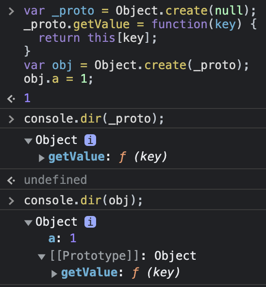

# 06 프로토타입

## 프로토타입의 개념 이해

```js
var instance = new Constructor();
```

1. 어떤 생성자 함수를 `new` 연산자와 함께 호출하면 
2. `Constructor`에서 정의된 내용으로 새로운 인스턴스가 생성된다.
3. 이때 `instance`에는 `__proto__`라는 프로퍼티가 자동으로 부여된다.
4. 이 `__proto__` 프로퍼티는 `Constructor`의 `prototype`이라는 프로퍼티가 부여된다.

> 참고) 브라우저에서  `Object.__proto__`로 접근할 수는 있지만, 웬만하면 `Object.getPrototypeOf()`/`Object.create()` 를 사용하자.

`__proto__`는 생략할 수 있고, 생략하는 것이 디폴트다.

```js
var Person = function(name) {
  this._name = name;
}
Person.prototype.getName = function() {
  return this._name;
}

var suzi = new Person('suzi');
suzi.__proto__.getName();	//undefined

Person.prototype = suzi.__proto__;	// true
```

그래서 이 경우엔 `suzi.__proto__.getName()`이 "메소드"로서 호출되었고, `suzi.__proto__`안에 `_this`라는 프로퍼티가 없기 때문에 `undefined`를 반환한다. 하지만 더 중요한 건, `getName()`을 호출했을 때 에러가 나지 않으므로 `__proto__`에 해당 메소드가 실제로 존재한다는 것이다.
`.__proto__`자체는 생략이 가능하지만, this Binding이 잘못되어서 `suzi.__proto__.getName()`일 경우 this는 `__proto__`를, `suzi.getName()`일 경우는 `suzi`를 가리킨다.

> 생성자 함수의 `prototype`에 어떤 메소드나 프로퍼티가 있다면 인스턴스에서도 마치 자신의 것처럼 해당 메소드나 프로퍼티에 접근할 수 있게 된다.

그래서 `Array.isArray()`는 `Array` 객체의 프로토타입 메소드가 아닌 `Array`의 메소드이기 때문에, 배열 변수에서 접근할 수 없다.

### constructor 프로퍼티

* 생성자 함수의 `prototype` 객체 내부에 존재한다.
* 인스턴스의 `__proto__`에도 존재한다.
* 원래의 생성자 함수(자기 자신)를 참조한다.
* 인스턴스에서 `__proto__.constructor`를 변경한다고 해도 참조가 바뀌는 것이지 원형이 바뀌는 게 아니다.

## 프로토타입 체인

### 메소드 오버라이드

인스턴스에 생성자의 `prototype`의 메소드의 이름과 같은 메소드가 있는 경우 해당 메소드가 오버라이드된다.

```js
var Person = function(name) {
  this.name = name;
}
Person.prototype.getName = function() {
  return this.name;
}

var iu = new Person('지금');
iu.getName = function() {
  return '바로 ' + this.name;
}
iu.getName();	// 바로 지금
iu.__proto__.getName();	// undefined
// 우회적인 방법
iu.__proto__.getName.call(iu);	// 지금
```

`iu.getName()`가 `Person`의 `getName()`를 오버라이드하였다.
이것은 `Person.prototype.getName()`이 교체되는 것이 아니라서 원형의 프로토타입 메소드에도 접근할 수 있다(13번째 줄)

### 프로토타입 체인

**프로토타입 체인** : 어떤 데이터의  `__proto__` 프로퍼티 내부에 다시 `__proto__` 프로퍼티가 연쇄적으로 이어진 것
**프로토타입 체이닝** : 이 체인을 따라가며 검색하는 것

모든 객체는 `__proto__.constructor`를 가지고 있기 때문에 원형을 끝없이 참조할 수 있다.

`Array`의 같은 경우에는 `Object`의 인스턴스이므로 `Object.prototype`을 `Array.prototype`이 참조한다.
그리고 `Object.prototype`를 `Object.__proto__`가 참조한다.
이렇게 타고 올라가면 끝없이 올라갈 수 있다.

추가로, 생성자도 함수이기 때문에 `Array`와 같은 원형 생성자는 `Function`의 인스턴스이다. 

```js
var arr = [1, 2];
arr.__proto__ === Array.prototype;
arr.__proto__.constructor === Array;
arr.__proto__.__proto__ === Object.prototype;
Object.prototype.constructor === Object;
Object.prototype.constructor.prototype.constructor === Object;

arr.constructor.constructor === Function;
Function.prototype.constructor === Function;
```

이게 가능한 이유는 생성자 함수가 자신을 참조할 수 있는 객체의 원형인 `constructor` 를 가지고 있기 때문이다.

이 때문에 프로토타입의 최상단에는 항상 `Object.prototype`이 있다.

### 객체 전용 메소드의 예외사항

객체 전용 메소드의 경우 `prototype`이 아닌 static 메소드로 지정해주어야 한다.
`Object.prototype`의 경우 참조형 객체 뿐아니라 **기본형** 데이터 프로토타입에서도 접근할 수 있기 때문에, `prototype`에 객체에서만 사용할 메소드를 정의하게 될 경우 기본형 데이터들도 해당 메소드에 접근할 수 있기 때문이다.
이러한 이유로  `Object.freeze(instance)`,  `Object.getPrototypeOf(instance)`의 메소드들이 `Object`의 static 메소드로 존재한다.
그렇지 않을 경우 `number.getPrototype()`같은 경우가 발생할 수 있기 때문이다.

반대로  `Object.prototype`에는 어떠한 데이터에서도 사용할 수 있는 메소드들만 있다.

### `__proto__`가 없는 객체

모든 객체는 `__proto__`를 갖게 되는데, 예외적으로 `Object.create(null)`로 객체를 생성할 경우 `__proto__`가 없는 객체가 생성된다.

```js
var _proto = Object.create(null);
_proto.getValue = function(key) {
  return this[key];
}
var obj = Object.create(_proto);
obj.a = 1;
console.log(obj.getValue('a'));	// 1
```



`Object.prototype`의 기본적인 메소드를 사용하지 못하는 대신, 객체가 가벼워져서 기본적인 성능이 좋아진다.

