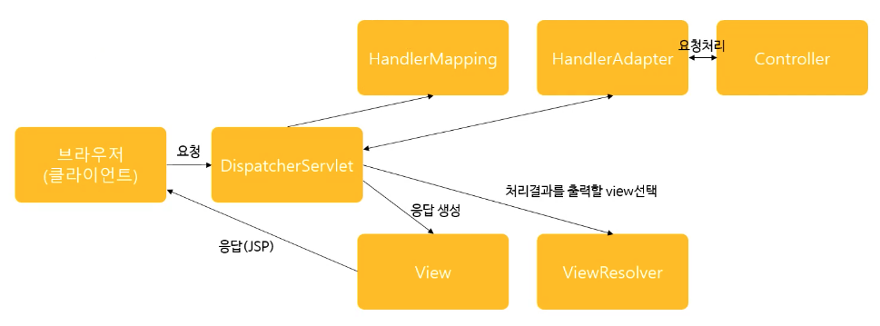

# 설계 모델
### MVC 모델
1. 클라이언트가 서버에 request
2. 서버에 **Controller**가 받아서 작업에 해당하는 Service(기능마다 존재)에게 전달
3. DB가 필요하면 DAO에서 **Model**를 이용하여 DB와 통신
4. Service에서 작업이 다 끝나면 Controller에서 **View**를 생성하여 클라이언트에게 Response

## Spring MVC 프레임워크 설계 구조



* DispathcherServlet
    * 클라이언트의 요청을 받음
* HandlerMapping
    * 여러 개의 Controller 중에서 가장 적합한 Controller 선택
* HandlerAdapter
    * 해당 Controller에서 요청에 적합한 메소드를 선택
* Controller
    * Service, DAO, DB와 연결
    * 작업을 수행한 후 model, view를 반환
* ViewResolver
    * 해당 작업 중 가장 적합한 View를 선택


1. 클라이언트의 request를 DispatcherServlet이 받음
2. DispatcherServlet은 적합한 Controller를 선택하여 다시 서블릿에게 보내준다.
3. 해당 컨트롤러를 받은 서블릿은 HandlerAdapter에게 요청한다.
4. 어댑터는 컨트롤러에서 적합한 메소드를 찾아 작업을 요청한다.
5. 컨트롤러는 작업을 수행한 후 model, view를 반환한다.
6. 서블릿은 ViewResolver에게 요청하여 가장 적합한 view를 찾아 반환한다.
7. 서블릿은 해당 View에 응답을 생성한다.
8. View가 클라이언트에게 Response를 보낸다.

#### 특징
* HandlerMapping, HandlerAdapter, ViewResolver는 스프링 컨테이너가 생성된 후 컨테이너 안에 자동으로 생성된다.
    * 수정할 필요 X
* 개발자가 작업해야하는 것들은 Controller, View

### DispatcherServlet
#### `web.xml`에 서블릿 mapping
```xml
<!--> web.xml <-->
<servlet>
    <servlet-name>{서블릿 별칭}</servlet-name>
    <servlet-class>{패키지 이름을 포함한 전체 서블릿명}</servlet-class>
    <init-param>
        <param-name>{Spring 설정 파일 이름}</param-name>
        <param-value>WEB-INF/spring/appServlet/{Spring 설정 파일}</param-value>
    </init-param>
</servlet>
<servlet-mapping>
    <servlet-name>{서블릿 별칭}</servlet-name>
    <url-pattern>/{맵핑명}</url-pattern>
</servlet-mapping>
```

### Controller 객체
* `servlet-context.xml` 파일에 `<annotation-driven/>` 만 기재하면 만들 수 있다.
* Controller 객체로 사용할 클래스를 정의할 땐 클래스에 `@Controller` 어노테이션을 붙여야 한다.
    * HandlerMapping이 해당 컨트롤러를 찾을 수 있다.

```java
@Controller
public class HomeController {
    // 엄청난 코드
}
```

#### `@RequestMapping`
* Adapter가 적절한 메소드를 찾기 위해선 컨트롤러 클래스 멤버 메소드에 `@RequestMapping("/{메소드명}")` 어노테이션을 붙여야 한다.

```java
@Controller
public class HomeController {
    ...

    @RequestMapping("/sampleMethod")
    public String sampleFunc(Model model) {

    }
}
```

#### Model 타입 파라미터
* 맵핑된 메소드에 파라미터로 `Model` 타입의 객체가 전달된다.
* `setAttribute()` 함수를 통해서 Model를 수정할 수 있으며 작업이 끝난 후 서블릿에게 전달된다.

```java
@Controller
public class HomeController {
    ...

    @RequestMapping("/sampleMethod")
    public String sampleFunc(Model model) {
        model.setAttribute("tmpData", "model has data!!");
    }
}
```

### View 객체
* `InternalResourceViewResolver` 빈 객체를 추가해야 한다.
* 맵핑된 메소드의 반환값과 `suffix` 값을 합친 이름의 jsp를 찾는다.


```xml
<!--> spring 설정 파일 <-->
<beans:bean class="org.springframework.web.servlet.view.InternalResourceViewResolver">
    <beans:property name="prefix" value="/WEB-INF/views/"/>
    <beans:property name="suffix" value=".jsp"/>
</beans:bean>
```

```java
@Controller
public class HomeController {
    ...

    @RequestMapping("/sampleMethod")
    public String sampleFunc(Model model) {
        model.setAttribute("tmpData", "model has data!!");

        return "success";
    }
}
```

> => `/WEB-INF/views/success.jsp`


