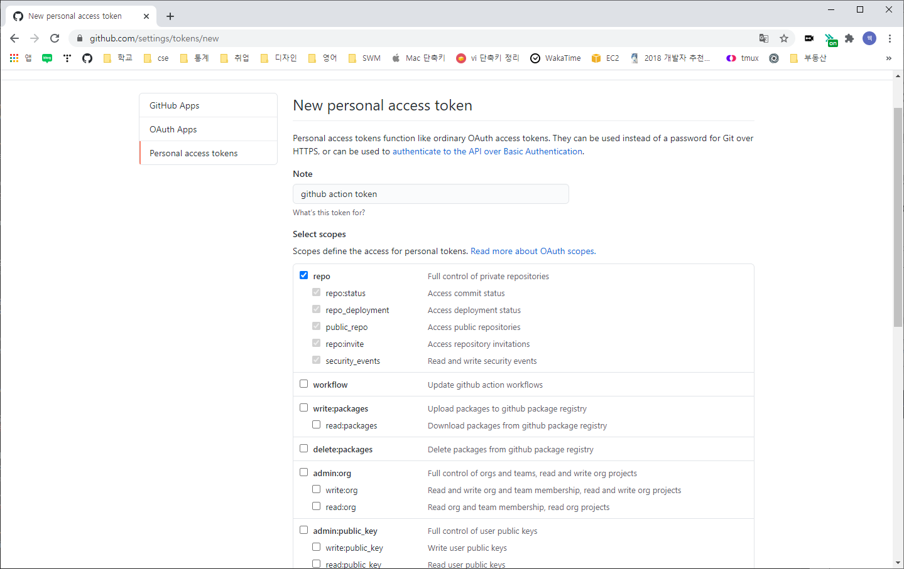
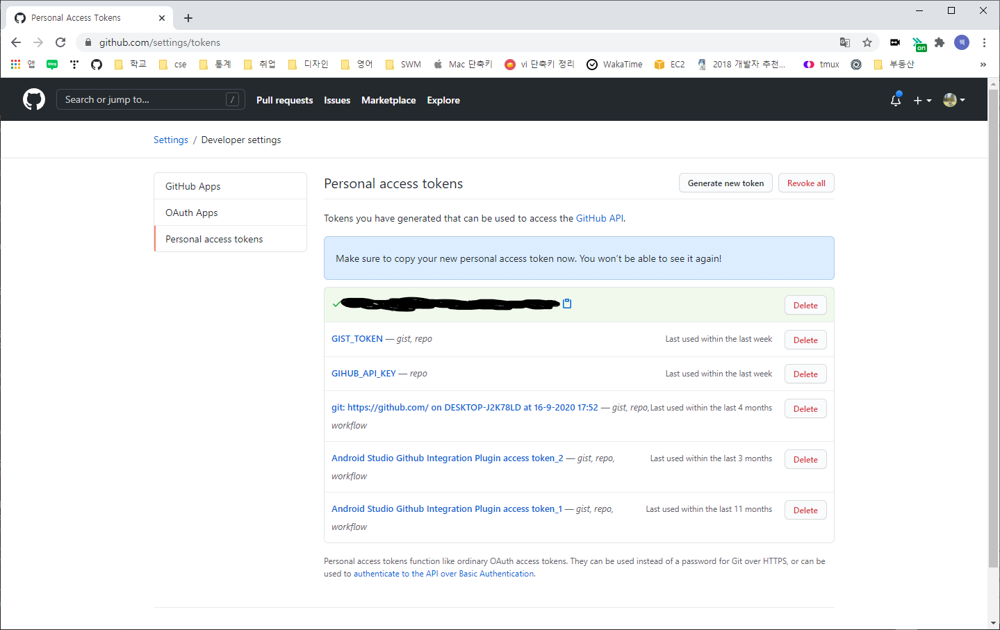
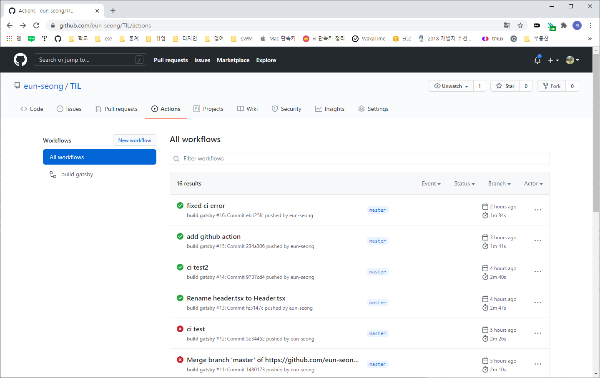
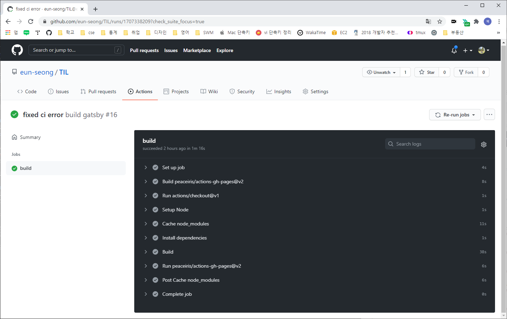

현재 gatsby로 github.io를 생성하여 개발 중입니다.   
그런데 push 할 때마다 빌드하고 배포하는 것이 번거러워 찾아보니 Github Action으로 CI를 만드는 것이 있더라구요!   
바로 적용을 해보았습니다.   

먼저 보통 github page의 url은 제 페이지처럼   
[`https://eun-seong.github.io/TIL/`](https://eun-seong.github.io/TIL/)   
이렇게 생겼을 것입니다.   

혹은 뒤에 repository 이름이 없는 `username.github.io`로만 구성이 되어 있기도 합니다.

#### 1. `gatsby-config.js` 파일 수정

저처럼 url 뒤에 repo 이름이 붙는 페이지는 개츠비 프로젝트의 gatsby-config.js 파일에 `pathPrefix`를 추가로 설정을 해주어야 합니다.
형식은 `pathPrefix: '/reponame'` 로 넣으시면 됩니다.   
저는 개츠비의 repository 이름이 `TIL` 이기 때문에 아래처럼 작성하였습니다.

```js {numberLines}
const path = require('path');

module.exports = {
  pathPrefix: '/TIL',
  
  siteMetadata: {
  	...
  },
  plugins: [
	...
  ],
};
```

그리고 빌드를 할 때 아래처럼 실행해야 합니다.

```shell
$ gatsby build --prefix-path
```

이렇게 하지 않으면 로컬에서는 잘 실행되는 듯 하지만, 깃에 배포할 때 루트 디렉토리가 잘못 설정되어 404 오류가 발생합니다.


#### 2 deploy.yml 파일 생성
이제 프로젝트의 루프 폴더에 `.github/workflows` 폴더를 생성하고 그 안에 `deploy.yml` 파일을 생성합니다.   

이 파일에 들어갈 내용을 한 번 살펴 볼게요.   

`.github/workflows/deploy.yml`
```yml {numberLines}
name: build gatsby
on:
  push:
    branches:
      - master

jobs:
  build:
    runs-on: ubuntu-latest
    steps:
      - uses: actions/checkout@v1
      - name: Setup Node
        uses: actions/setup-node@v1
        with:
          node-version: '14.x'
      - name: Cache node_modules
        uses: actions/cache@v1
        with:
          path: node_modules
          key: ${{runner.OS}}-build-${{hashFiles('**/yarn.lock')}}
          restore-keys: |
            ${{ runner.OS }}-build-${{ runner.OS }}-
      - name: Install dependencies
        run: yarn install --prod --pure-lockfile
      - name: Build
        run: yarn build --prefix-paths
        env:
          NODE_ENV: production
      - uses: peaceiris/actions-gh-pages@v2
        env:
          GITHUB_TOKEN: ${{ secrets.GITHUB_TOKEN }}
          PUBLISH_BRANCH: gh-pages
          PUBLISH_DIR: ./public

```

하나씩 천천히 살펴봅시다.   
* `name` : Action의 이름, 자신이 알아보기 편한 것으로 수정하셔도 됩니다.
* `on` : 액션이 실행될 이벤트, 저는 `master` 브랜치에서 `push`할 때 이벤트가 동작합니다. 다른 브랜치 혹은 `pull` 할 때 하고 싶은 분들은 밑에 추가로 써주시면 됩니다.
* `jobs` : 실행할 명령어
    * `runs-on` : 수행될 환경, 가장 최신의 우분투로 설정하였습니다.
    * `steps` : 수행할 목록, 적힌 순서대로 실행합니다.
        * `uses` : 다른 분들이 이미 만들어놓은 Action 입니다.
        * `name` : 액션의 이름, 없어도 무방합니다.
        * `run` : 명령어

제가 설정한 액션들의 차례는 아래와 같습니다.
1. `actions/checkout@v1`, 브랜치 checkout
2. `actions/setup-node@v1` node 세팅
3. `actions/cache@v1` node_modules를 캐싱하여 액션의 속도를 높여줍니다.
4. `Install dependencies` dependency를 설치합니다.
5. `Build` 빌드(Build)
6. `peaceiris/actions-gh-pages@v2` 배포(Deploy)

여기서 제가 했던 실수는 5번 빌드 입니다.   
앞서 언급했듯이 repository 루트를 설정하는 것을 몰라서 삽질했네용...   

자 모두 완료되었으면 다음으로 넘어가 봅시다.

#### Personal Access Token(PAT) 생성하기
자신의 깃허브로 들어가서   
Profile Settings -> Developer Settings -> Personal access token   
으로 이동합니다.   

위에    
Generate new token   
버튼을 클릭합니다.   

Note는 토큰의 이름이므로 자신이 하고 싶은 이름으로 설정하시면 됩니다.   
scope으로는 `repo`만 설정해주었습니다.   

  

그럼 이렇게 생성된 토큰이 보입니다. **이 토큰은 잘 복사를 해두세요!** 이 페이지를 한 번 나가면 다시 생성해야 합니다.   

  

#### Secret 추가하기
이제 자신의 개츠비 repo로 이동합니다.   
repository Settings -> Secrets   

New repository secret 버튼을 누릅니다.   
Name에 이름을 설정하시고, 아까 복사해두었던 토큰을 Value에 붙여넣습니다.   
저는 Name을 `GITHUB_TOKEN` 으로 하였습니다.

이제 준비는 다 되었습니다!

#### push 하기
이제 프로젝트 터미널로 이동하여 git에 push를 합니다.   
액션이 잘 수행되었는지 확인하려면 해당 레포지토리의 Action으로 들어가시면 됩니다.   

  

저는 또 다른 이유로도 실패를 계속 했었지만...   
진행이 되고 있다면 in progress 로 표시가 됩니다.   

해당 action을 클릭해서 들어가보면, 진행 중인 작업을 볼 수 있습니다.

  

실패했다면 해당 명령어를 클릭하여 오류 메세지를 확인해보시고,   
성공했다면 축하드립니다! 이제 빌드/배포를 직접하지 않아도 push만 하면 자동으로 실행됩니다.   
