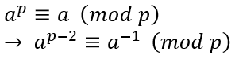
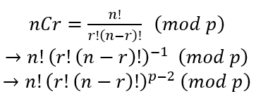

[BOJ 11401번 이항 계수3](https://www.acmicpc.net/problem/11401)

[BOJ 1010번 문제](https://eun-seong.github.io/TIL/Algorithm/boj_1010)를 풀다가 조합을 **페르마의 소정리**로 풀 수 있다는 사실을 알았다.   
이 문제에 풀었던 방식은 N이 작을 때는 가능하지만, N이 커지면 시간복잡도가 O(2^n)인 걸 보아 좋은 결과를 낼 수 없다는 걸 알 수 있다.   


> 풀이

```c++ {numberLines}
#include <iostream>
using namespace std;

#define DIV 1000000007

int main() {
  long long N,K,A=1,B=1,C=1;
  cin>>N>>K;

  for(int i=1;i<=N;i++) A = (A*i) % DIV;
  for(int i=1;i<=K;i++) B = (B*i) % DIV;
  for(int i=1;i<=N-K;i++) C = (C*i) % DIV;

  long long y = DIV-2, modB=1, modC=1;

  while(y) {
    if(y%2) {
      modB = (modB*B)%DIV;
    }

    B = (B*B)%DIV;
    y /= 2;
  }

  y = DIV -2;
  while(y) {
    if(y%2) {
      modC = (modC*C)%DIV;
    }

    C = (C*C) %DIV;
    y /= 2;
  }

  cout<<(((A*modB)%DIV)*modC)%DIV;

  return 0;
}
```

#### 페르마의 소정리
a가 정수이고 p가 소수일 때, 아래 식이 성립한다.

  

그리고 조합 공식에서 나누기를 곱하기로 바꾸면 아래처럼 진행된다.   
페르마의 소정리에서 a의 역수와 합동인 수로 대체하였다.   

  


> 참조한 사이트

페르마의 소정리 : [강정이 좋아 생각조리실](https://cru6548.tistory.com/23)   
고속 거듭 제곱 : [https://return-true.tistory.com/1](https://return-true.tistory.com/1)

